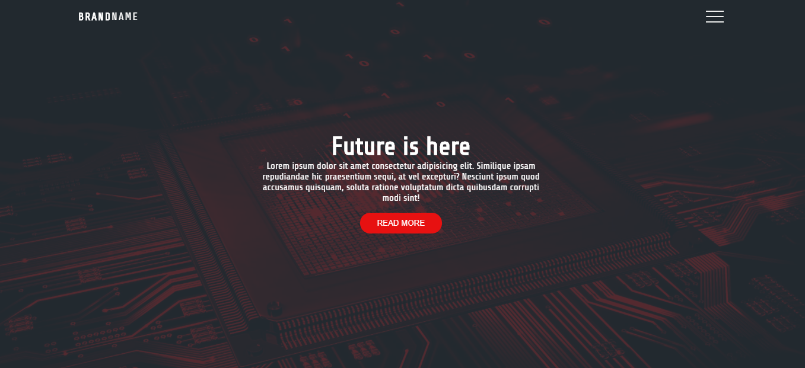
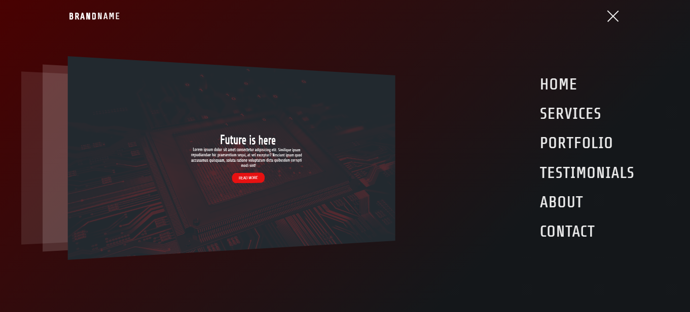

# Landing Page 3D Animation
=================

 <a href="#objetivo">Objetivo</a> •
 <a href="#tecnologias">Tecnologias</a> •
 <a href="#utilizar">Utilizando</a> •  
 <a href="#licenca">Licença</a> • 
 <a href="#autor">Autor</a>

## PREVIEW
---
### INITIAL:

### PAGE:

---

## Linguagens utilizadas:

<a href="https://developer.mozilla.org/pt-BR/docs/Aprender/JavaScript">

</a>

---

## UTILIZANDO

Antes de começar, você vai precisar ter instalado em sua máquina, qualquer navegador para internet:
    
- Google Chrome
- Firefox
- Safari
- Microsoft Edge

    Acesse: <a href="https://diegoreports.github.io/BarAnimation3D.io/">https://diegoreports.github.io/BarAnimation3D.io/</a>

---

## OBJETIVO

Este projeto foi o proposito de desenvolver conhecimento de CSS3, utilizando @keyframes e animações para transição de página e menu.

---

## STATUS DO PROJETO

<h4 align="center"> 
	🚧  🚀 CONCLUÍDO !  🚧
</h4>

---

## Licença

---

### Autor
---

<a href="https://blog.rocketseat.com.br/author/thiago/">
 
  
 

Feito com ❤️ por Diego Henrique

 
 

